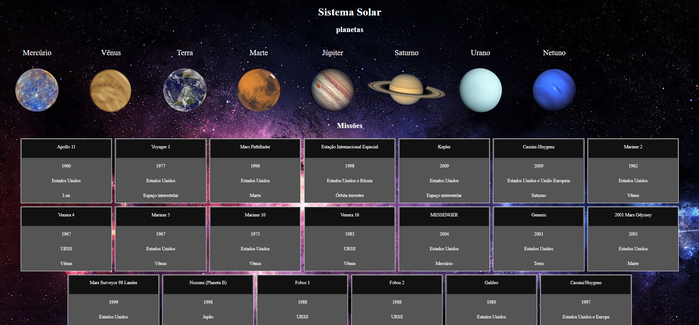

<h1>Projeto Solar System</h1>

<h2>Habilidades adquiridas:</h2>
<ul>
  <li>Utilizar JSX no React</li>
  <li>Utilizar corretamente o método render() para renderizar seus componentes</li>
  <li>Utilizar import para trazer componentes em diferentes arquivos</li>
  <li>Criar componentes de classe em React</li>
  <li>Criar múltiplos componentes a partir de um array</li>
  <li>Fazer uso de props corretamente</li>
  <li>Fazer uso de PropTypes para validar as props de um componente</li>
</ul>

Projeto desenvolvido em: 25/02/2022

